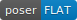

# PHP badges poser [](https://github.com/badges/poser/actions)

This is a php library that creates badges like  and  and ,
according to [Shields specification](https://github.com/badges/shields#specification).

This library is used by https://poser.pugx.org

[](https://packagist.org/packages/badges/poser) [](//packagist.org/packages/badges/poser) [](https://packagist.org/packages/badges/poser)
[](//packagist.org/packages/badges/poser)
[](https://packagist.org/packages/badges/poser)

## Dependencies

* PHP 8.1 or higher
* GD extension

you can still use the library with lower PHP versions, using the old releases

## Use as command

#### 1. Create a project

```bash
composer create-project badges/poser
ln -s poser/bin/poser /usr/local/bin/poser
```

#### 2. Launch the command

Create an image
```bash
poser license MIT blue -p "license.svg"
```

Flush an image
```bash
poser license MIT blue
```

Choose a different style
```bash
poser license MIT blue -s "for-the-badge"
```

You can also use the provided Docker Compose services:

```bash
docker compose run --rm php82 bin/poser license MIT blue
docker compose run --rm php83 bin/poser license MIT blue -p "license.svg"
docker compose run --rm php83 bin/poser license MIT blue -s "plastic" -p "license-plastic.svg"
```


## Usage as library

#### 1. Add to composer dependencies

```bash
composer require badges/poser
```

#### 2. Use in your project as lib

```php
use PUGX\Poser\Render\SvgPlasticRender;
use PUGX\Poser\Poser;

$render = new SvgPlasticRender();
$poser = new Poser([$render]);

echo $poser->generate('license', 'MIT', '428F7E', 'plastic');
// or
echo $poser->generateFromURI('license-MIT-428F7E.svg?style=plastic');
// or
echo $poser->generateFromURI('license-MIT-428F7E?style=plastic');
// or
$image = $poser->generate('license', 'MIT', '428F7E', 'plastic');

echo $image->getStyle();
```

The allowed styles are: `plastic`, `flat`, `flat-square`, and `for-the-badge`.

### Examples (generated with `make doc-images`)




## Encoding

Dashes `--` → `-` Dash

Underscores `__` → `_` Underscore

`_` or Space → Space


## More

For *more info* please see the [behat features](./features/)
and the examples in the [php-spec folder](./spec/)


## Why a composer badge?

Not only because all the other languages already have it, but having the latest stable release in the readme could save time.


## Contributing

Active contribution and patches are very welcome.  
Please refer to [CONTRIBUTING](CONTRIBUTING.md)


## Docker development

You can use the env var CONTAINER to run the tests in a specific PHP version.
The default version if CONTAINER is omitted is php83.

#### 1. Setup your Docker environment

```bash
CONTAINER=php83 make setup
```

#### 2. Run the tests

```bash
CONTAINER=php83 make tests
```

#### 3. Run the tests for all PHP versions

```bash
make matrix-tests
```


## License

[](./LICENSE)
